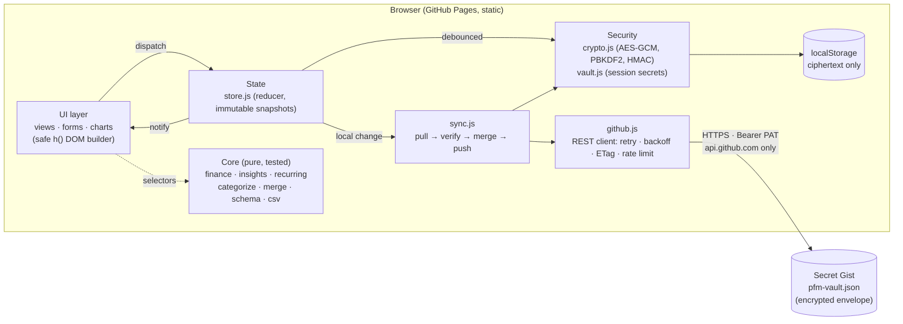
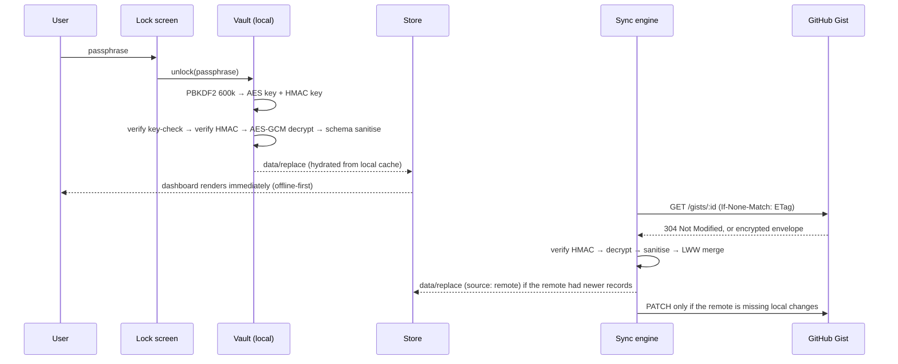

# Ledgerly — Zero-Knowledge Personal Finance Manager

[](https://github.com/chysreax/personal-finance/actions/workflows/deploy.yml)

**Live app → https://chysreax.github.io/personal-finance/**

Ledgerly is a production-grade personal finance manager that runs entirely in the browser. It is hosted as static files on GitHub Pages and uses **your own secret GitHub Gist as an encrypted NoSQL document store**. Data is encrypted on your device with **AES-256-GCM** under a key derived from your master passphrase and sealed with **HMAC-SHA256**, so GitHub only ever stores ciphertext. There is no backend, no account, and no third-party code.

> Try it in 10 seconds: open the live URL, pick a passphrase, keep **“Start with 12 months of demo data”** checked, and explore. To sync across devices, open **Settings → Cloud sync** and paste a token with the `gist` scope.

---

## Contents
1. [Features](#features)
2. [Quick start](#quick-start)
3. [Architecture](#architecture)
4. [Pseudo-cloud persistence (GitHub Gist as NoSQL)](#pseudo-cloud-persistence-github-gist-as-nosql)
5. [Security model](#security-model)
6. [Error resilience](#error-resilience)
7. [Data model](#data-model)
8. [Project structure](#project-structure)
9. [Development, testing & deployment](#development-testing--deployment)
10. [Deployment log](#deployment-log)

---

## Features

| Area | What you get |
|---|---|
| **Dashboard** | Live net worth (12-month sparkline and month-over-month delta), month income/spending (compared with the same day last month), net cash flow and savings rate, 6-month cash-flow chart, **financial health score**, 30-day category donut, budget snapshot, insights, upcoming bills, recent activity, accounts |
| **Transactions** | Add / edit / delete with **undo**; type, category, account, date range, tag and multi-term search (payee, note, `#tag`, category, account, amount); 4 sort orders; day grouping with daily net; bulk select → re-categorize or delete; paginated rendering; **CSV import** (auto-detects bank layouts, date formats, debit/credit columns) and **CSV export** (formula-injection safe) |
| **Auto-categorization** | Three tiers: your rules (“payee contains X”) → **learned from history** (majority vote per normalized payee) → built-in merchant dictionary. Live suggestion while typing; one-click “categorize all uncategorized” |
| **Analytics** | 3M / 6M / 12M / YTD / All ranges; income vs. spending bars; net cash flow; net-worth trend; interactive category donut (click to drill into a trend); per-category trend line; top merchants; weekday spending heat strip; full recommendations list. Every chart has hover tooltips and a screen-reader data table |
| **Budgets** | Monthly category limits, **spending-velocity alerts** (projected month-end spend vs. limit), an “expected by today” tick on every bar, safe-to-spend per day, month navigation, unbudgeted-spending list, **one-click budget suggestions from 3-month averages** |
| **Goals** | Targets with deadlines, animated progress, contributions and withdrawals, required monthly amount, 90-day contribution pace, **projected completion date**, on-track / behind status, total funding need vs. average surplus |
| **Recurring & forecast** | Bills, subscriptions and paychecks; **automatic detection of recurring payments** from history (interval and amount regularity, with a confidence score); due-item posting and skipping; **30/90/180-day cash-flow forecast** (scheduled items plus typical day-to-day net) with the lowest-balance point |
| **Insights engine** | 12 rule-based detectors: forecast shortfall, budget over/over-pace, category spikes (month-to-date vs. the same days of prior months), savings rate, emergency-fund coverage, subscription cost, statistical outliers (> mean + 3σ), possible duplicates, goals behind schedule, untracked recurring payments, uncategorized items, due payments. Each insight links to an action |
| **Accounts** | Checking, savings, cash, investment, credit card, loan. Balances computed live; assets/liabilities split; archiving |
| **Sync & portability** | Encrypted Gist sync (create / read / update / delete), multi-device conflict-free merge, offline queue; encrypted backup, plain JSON export/import (merge or replace), CSV, demo data, erase device |
| **UX** | Dark and light themes (system-aware, no flash), optimistic updates, toasts with undo, skeleton-free instant renders, keyboard shortcuts (`n` new transaction, `/` search), focus-trapped modals that become bottom sheets on mobile, reduced-motion support, responsive at 375px and up (bottom nav and FAB on phones, icon rail on tablets, sidebar on desktop), installable PWA with an offline app shell |

## Quick start

1. Open **https://chysreax.github.io/personal-finance/**.
2. Create a **master passphrase** (at least 10 characters and a “Fair” or better strength score). It never leaves your device and cannot be recovered.
3. Optional: enable cloud sync.
   - Create a token: **[github.com/settings/tokens/new?scopes=gist](https://github.com/settings/tokens/new?scopes=gist&description=Personal%20Finance%20Manager)** (classic, `gist` scope only) **or** a fine-grained token with *Account permissions → Gists: Read and write*.
   - In Ledgerly: **Settings → Cloud sync → paste token → Connect & sync**. A **secret** gist containing `pfm-vault.json` (ciphertext) is created, or an existing one is found automatically.
4. On a second device, choose **“I already have a vault on GitHub”**, then paste the token and enter the same passphrase.

## Architecture



**Layering rules**

- `js/core/**` is pure, DOM-free and fully unit-tested under Node.
- `js/services/**` (storage, vault/session, GitHub client, sync engine) takes its dependencies by injection (`fetchImpl`, storage backend, clocks), which is what lets the whole sync engine run against a fake GitHub API in the tests.
- `js/state/store.js` is the single source of truth. Every mutation goes through the reducer, which stamps `updatedAt` monotonically for the merge.
- `js/ui/**` only reads selectors and dispatches actions. Views are `render(app) → Node` functions. The router re-renders on store changes inside a `requestAnimationFrame` and restores focus, caret and scroll, so background syncs never interrupt typing.
- `js/main.js` is the composition root that wires everything together.

### Startup & state hydration



## Pseudo-cloud persistence (GitHub Gist as NoSQL)

The gist is treated as a single-document NoSQL store holding one file, `pfm-vault.json`, which contains the encrypted envelope.

| CRUD | GitHub REST call | Where |
|---|---|---|
| **Create** | `POST /gists` (`public: false`) | first connect, or **Recreate** after deletion |
| **Read** | `GET /gists/:id` with `If-None-Match` (304s are free); large files fall back to `raw_url` **without** the token | every sync and poll |
| **Update** | `PATCH /gists/:id` | debounced 1.5 s after local edits |
| **Delete** | `DELETE /gists/:id` | Settings → *Delete remote vault* (type-to-confirm) |
| Discover | `GET /gists?per_page=100` (scans for `pfm-vault.json`) | connect / restore without an id |

**Conflict-free multi-device merge.** Every record carries `updatedAt`, and deletes are tombstones. Merging is a per-record last-writer-wins union (a state-based CRDT: commutative, associative and idempotent), so offline edits on two devices both survive. The deterministic tie-break makes every replica pick the same winner. Pushes happen only when the remote is missing something, and stale reads from GitHub's cache are detected through the envelope `rev` so they never cause push storms. Tombstones older than 120 days are pruned.

**Real-time consistency across views.** All views render from one store snapshot, so a remote merge instantly updates every screen. The sync status pill, sidebar card and blocking banners subscribe to the engine's state. Polling runs every 60 s while the tab is visible, plus on `online`, on tab focus and after every local edit.

## Security model

### 1. Client-side zero-knowledge encryption *(Web Crypto API)*

```text
passphrase ──NFKC──► PBKDF2-HMAC-SHA256 (600,000 iterations, 16-byte random salt) ──► 512 bits
                                   ├── bits 0–255   → AES-256-GCM key   (non-extractable CryptoKey)
                                   └── bits 256–511 → HMAC-SHA256 key   (non-extractable CryptoKey)

envelope = {
  format: "pfm-vault", v: 1,
  kdf:    { name: "PBKDF2-SHA256", iterations, salt },
  keyCheck: HMAC(macKey, "pfm:key-check:v1"),          // tells wrong passphrase apart from tampering
  cipher: { name: "AES-256-GCM", iv: 96-bit random },   // fresh IV on every write
  meta:   { rev, updatedAt, deviceId },                 // bound as GCM additional data
  ct:     AES-GCM(encKey, iv, JSON(data), aad=header),
  mac:    { alg: "HMAC-SHA256", value: HMAC(macKey, header ‖ ct) }
}
```

- The **same envelope** protects the remote gist, the local `localStorage` cache, the optional remembered token and encrypted backups. No financial data is ever stored or transmitted in plaintext.
- The passphrase itself is never stored, only the non-extractable keys derived from it, which live in memory during a session. Raw key bits are zeroed after import.
- Unlocking has progressive throttling after 5 failed attempts. A KDF-parameter allow-list (100k–5M iterations) blocks denial-of-service attacks through a tampered envelope.

### 2. Cryptographic data integrity *(HMAC-SHA256)*
Opening a vault verifies, in order: **structure** → **key-check** (wrong passphrase?) → **HMAC over every field** (tampered?) → **AES-GCM tag**. If the remote gist was modified outside the app (even only its `rev` or `deviceId` metadata), Ledgerly shows an **Integrity alert** banner, pauses sync, leaves local data untouched, and offers *Retry verification* or *Restore remote from this device*. **Settings → Verify integrity** re-downloads and re-verifies the remote on demand and shows the revision, writer device and ciphertext fingerprint.

### 3. Secure token handling *(zero-trace)*
- The PAT is held **in a closure in memory only** (never on `window`, in the DOM or in logs). The input field is cleared right after connecting.
- **Remember on this device** is opt-in, and the token is then stored **encrypted with the vault key**. It is never in plaintext.
- **Session expiry:** every token has a lifetime (1 h – 30 d) that is enforced on every read, and expired tokens are purged.
- **Auto-lock** after inactivity (1–60 min, with a 30 s warning) and **Lock now** purge keys, token and decrypted data from memory. Time spent in a background tab counts as inactivity.
- **No network leakage:** the token is sent only as an `Authorization` header to `https://api.github.com`, never in a URL. Raw-file downloads go to `gist.githubusercontent.com` **without** it. `credentials: 'omit'`, `referrerPolicy: 'no-referrer'` and `redirect: 'error'` are set on every request.
- **No logging:** CI fails the build on any `console.*` call. Every surfaced error string passes through `redact()`, which strips `ghp_…`, `github_pat_…` and `Bearer …` patterns. A 401 response purges the token immediately.
- Token *shape* is validated before any request, which rejects passwords pasted by mistake and header injection.

### 4. XSS & injection prevention
- **Safe DOM bindings:** all markup is created by `js/ui/dom.js`. Text always becomes Text nodes; `innerHTML`/`outerHTML`/`srcdoc` throw; `on*` attributes are refused (handlers are bound as functions); `href`/`src` accept only `#…` or `https:` URLs.
- **Trusted Types enforced** (`require-trusted-types-for 'script'; trusted-types pfm-sw`). The only policy permitted can mint exactly one value, the service-worker URL `./sw.js`. No HTML policy exists, so any string reaching `innerHTML` or a similar sink throws at runtime.
- **Strict CSP meta tag:** `default-src 'none'; script-src 'self'; style-src 'self'; connect-src 'self' https://api.github.com https://gist.githubusercontent.com; object-src 'none'; base-uri 'none'; form-action 'none'; …` There are no inline scripts or styles (styling goes through the CSSOM), and `connect-src` blocks exfiltration to any other host.
- **Schema sanitiser** on every untrusted input (remote, JSON import, CSV, local cache): type checks, id/date/amount validation, length caps, record-count caps, stripping of control and bidi-override characters, and referential repair.
- **CSV formula-injection** protection on export (`=`, `+`, `-`, `@` cells are prefixed). Auto-categorization rules use substring matching only, so user-supplied regular expressions cannot cause ReDoS.
- `scripts/check.mjs` (CI) fails on HTML sinks, `eval`, `new Function`, inline scripts or styles, or a missing CSP directive.

> GitHub Pages cannot set HTTP headers, so `frame-ancestors` (which is ignored in meta CSP) is not available. Everything else is enforced from the meta tag.

## Error resilience

| Situation | Behaviour |
|---|---|
| Offline / network drop | Status **Offline**; edits keep working and are queued (`dirty` persists across reloads); exponential backoff (15 s → 5 min) plus an immediate retry on the `online` event |
| Timeout | 15 s `AbortController` per request; retried with jittered backoff |
| GitHub 5xx | Retried, then status **Sync error** with an automatic retry countdown |
| Primary rate limit (`x-ratelimit-remaining: 0`) | Status **Rate limited**, sync resumes at `x-ratelimit-reset`; conditional GETs (304) don't consume quota |
| Secondary rate limit / `retry-after` | Short waits are honoured automatically |
| Invalid / revoked / expired token (401) | Token purged everywhere; **Reconnect needed** banner |
| Missing `gist` scope (403) | Clear message naming the exact scope or permission needed |
| Gist deleted (404) | **Remote missing**, with one-click *Recreate vault gist* |
| Malformed remote JSON / schema | **Remote unreadable**; never merged and never silently overwritten |
| Tampered remote (HMAC mismatch) | **Integrity alert**; sync paused; explicit restore |
| Passphrase changed on another device | **Passphrase needed**; enter it once and the device adopts the new key |
| Storage full / blocked | Clear toast; falls back to in-memory storage in private mode |
| Render exception | Caught per view with a recovery card; unhandled rejections become toasts (never console noise) |

## Data model

```jsonc
{
  "schema": 1,
  "accounts":     [{ "id", "name", "type": "checking|savings|cash|investment|credit|loan", "opening": cents, "archived", "color", "updatedAt", "deleted" }],
  "categories":   [{ "id", "name", "kind": "expense|income", "icon", "color", … }],
  "transactions": [{ "id", "date": "YYYY-MM-DD", "amount": cents>0, "type": "expense|income|transfer", "accountId", "toAccountId", "categoryId", "payee", "note", "tags": [], "recurringId", "createdAt", "updatedAt", "deleted" }],
  "budgets":      [{ "id", "categoryId", "limit": cents, … }],
  "goals":        [{ "id", "name", "target", "saved", "deadline", "icon", "color", "history": [{ "date", "amount" }], … }],
  "recurring":    [{ "id", "payee", "amount", "type", "categoryId", "accountId", "frequency": "weekly|biweekly|monthly|quarterly|yearly", "nextDate", "active", … }],
  "rules":        [{ "id", "pattern", "categoryId", … }],
  "settings":     { "currency", "budgetWarn", "updatedAt" }
}
```
Amounts are integer minor units (cents), so there is no floating-point drift. Liabilities have negative balances, and net worth is the sum of all balances.

## Project structure

```text
personal-finance/
├── index.html                # CSP + Trusted Types, no inline code
├── sw.js                     # offline app shell (same-origin GETs only; never caches API traffic)
├── manifest.webmanifest · 404.html · assets/icon.svg · .nojekyll
├── css/
│   ├── tokens.css            # design tokens (light/dark, CVD-validated series palette)
│   └── app.css               # components, layout, charts, responsive, motion
├── js/
│   ├── main.js               # composition root, router, lifecycle (lock/unlock), wiring
│   ├── theme-init.js         # pre-paint theme (no flash)
│   ├── core/                 # PURE logic — crypto, schema, merge, finance, insights, recurring, categorize, csv, money, dates, demo, redact
│   ├── services/             # storage, vault+session, GitHub client, sync engine
│   ├── state/store.js        # reducer + actions
│   └── ui/                   # dom (safe builder), components, charts, forms, shell, lock, autolock, theme, views/*
├── tests/                    # node:test — crypto, data/merge/csv/store, finance, sync (fake GitHub API)
├── scripts/                  # check (lint), build (dist + modulepreload + cache stamp), serve, smoke
└── .github/workflows/deploy.yml
```

## Development, testing & deployment

```bash
npm run serve        # http://localhost:5173 (zero dependencies)
npm run check        # integrity & security lint
npm test             # 36 tests: crypto, merge, schema, CSV, finance, insights, sync engine vs fake GitHub
npm run build        # → dist/ with modulepreload graph + build-stamped service worker
node scripts/smoke.mjs https://chysreax.github.io/personal-finance/
```

The app uses **no npm dependencies**: ES modules are served as-is. The build step copies files, stamps the build id into the service-worker cache name, injects `<link rel="modulepreload">` for the whole module graph (the browser fetches every module in parallel, without a waterfall), and **cache-busts every module import, stylesheet and precache entry with `?v=<build>`**. GitHub Pages serves assets with `max-age=600`, so without this a fresh `index.html` could run stale modules for up to 10 minutes after a deploy.

**CI/CD** (`.github/workflows/deploy.yml`) runs on every push to `main`:
1. `npm run check`, which checks that imports resolve, the precache list matches disk, the CSP is complete, and there are no HTML sinks, `eval` or `console` calls.
2. `npm test`, the 36 unit and integration tests.
3. `npm run build`, then `actions/upload-pages-artifact`, then `actions/deploy-pages`.
4. **Post-deploy smoke test**: fetches the live page and every referenced and precached asset, and fails on any non-200 response or wrong MIME type.

## Deployment log

Full, live logs: **[Actions → CI & Deploy to GitHub Pages](https://github.com/chysreax/personal-finance/actions/workflows/deploy.yml)**

| Date (UTC) | Commit | Pipeline run | Jobs | Result |
|---|---|---|---|---|
| 2026-10-01 14:15 | [`5228c9a`](https://github.com/chysreax/personal-finance/commit/5228c9ac9ab1892697cbf972e2e4f65a22ce0c2d) initial release | [#36874877565](https://github.com/chysreax/personal-finance/actions/runs/36874877565) | lint & test & build 10 s · deploy 10 s · smoke 5 s | ✅ success. A manual browser audit then found one console error: Trusted Types (`trusted-types 'none'`) blocked `serviceWorker.register()` |
| 2026-10-01 14:17 | [`0987b91`](https://github.com/chysreax/personal-finance/commit/0987b91) `fix(csp)`: scoped Trusted Types policy `pfm-sw` | [#36875121200](https://github.com/chysreax/personal-finance/actions/runs/36875121200) | lint & test & build · deploy · smoke | ✅ success. Re-audit showed browsers still running the **cached** old `main.js` (Pages `max-age=600`) |
| 2026-10-01 14:20 | [`db56940`](https://github.com/chysreax/personal-finance/commit/db56940) `fix(build)`: versioned module graph (`?v=<build>`) | [#36875436945](https://github.com/chysreax/personal-finance/actions/runs/36875436945) | lint & test & build · deploy · smoke | ✅ success. Live audit: service worker **active** (cache `ledgerly-20261001-db56940`), 39 versioned modules, **0 failed requests, 0 console messages**; vault creation and all 8 views verified end to end |

Post-deploy verification of the live site (Chromium): 41 resources, 0 failures, 38 modules fetched in parallel via `modulepreload`. First contentful paint was ≈ 1.4 s on a cold CDN cache and ≈ 0.2 s from the local build.

---

MIT © 2026 chysreax
